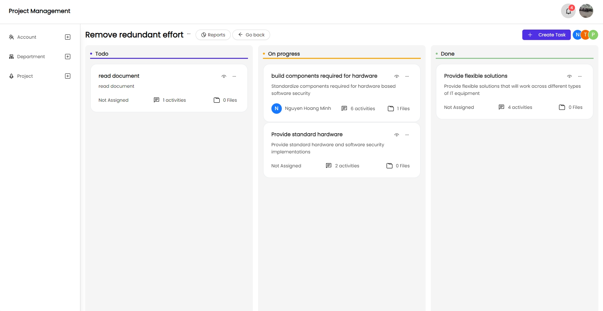
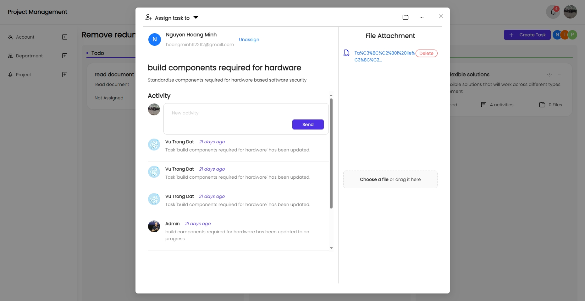
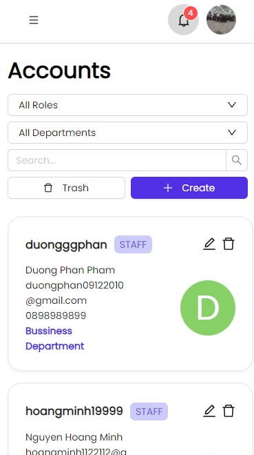
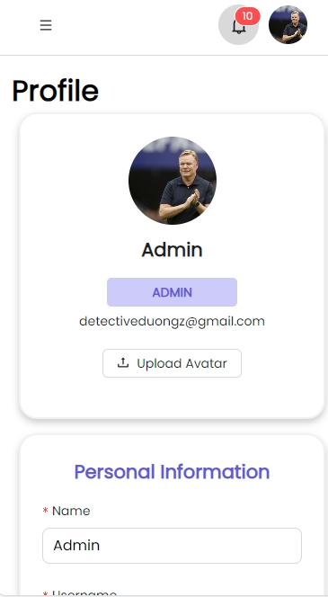

# My portfolio website

This is my portfolio, where I introduce mysefl, my experience and my tech stack.
You can open the website at https://chi-cong.github.io/Portfolio/  
Main techs are used in this app : 

- React 18
- Vites
- Ant Design 5.0
- Redux Toolkit/ RTK Query
- SocketIO

Here are some picture of the app

